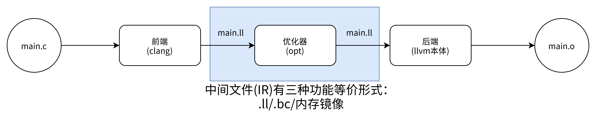
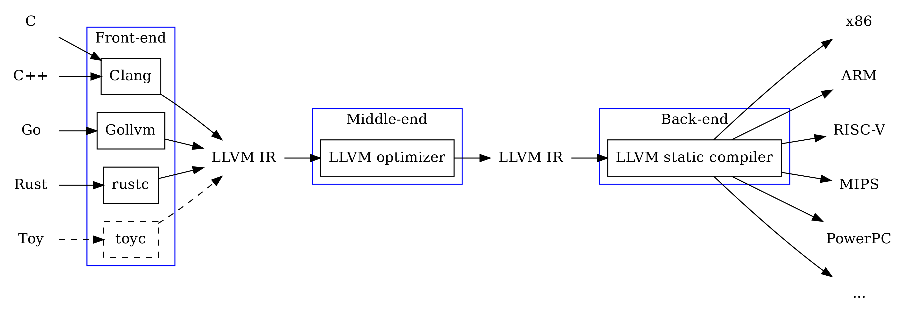
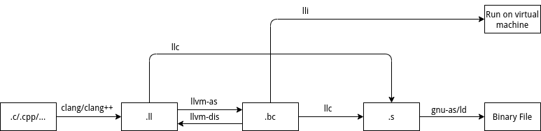
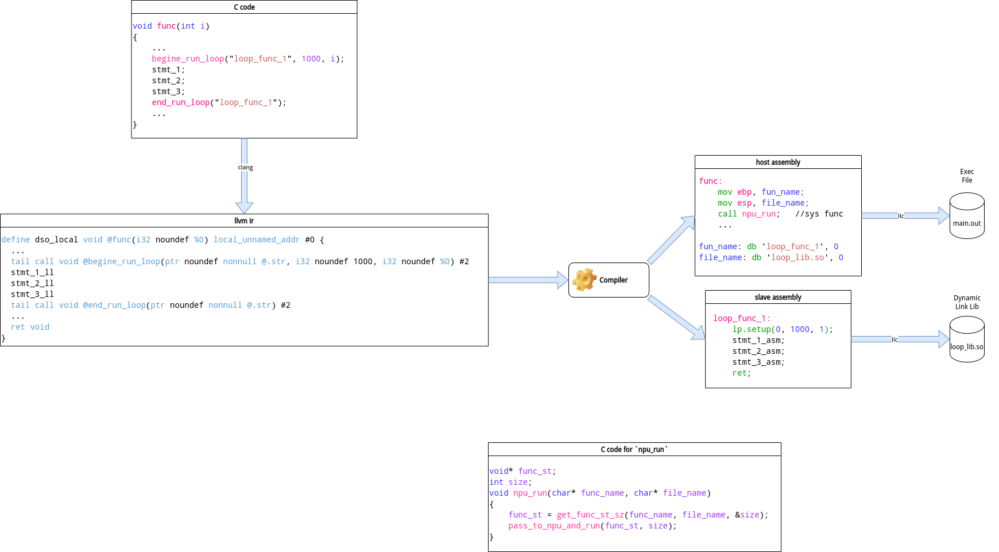

# 简介

LLVM的基本流程如下



面对不同前后端



文件流



# Backend CodeGen

## Tablegen

## Instruction Schedule

### Example

C file:

```c
void test(int a, int *x, int *y)
{
    int b = a * x[0] + y[0];
    int c = b + x[1];
    int d = c * y[1];
    y[2] = b + c + d;
}
```

DAG print out:

```llvm
bb.0 (%ir-block.3): liveins: $edi, $rsi, $rdx
    %2:gr64 = COPY $rdx
    %1:gr64 = COPY $rsi
    %4:gr32 = COPY $edi
    %4:gr32 = nsw IMUL32rm %4:gr32(tied-def 0), %1:gr64, 1, $noreg, 0, $noreg, implicit-def dead $eflags :: (load (s32) from %ir.1, !tbaa !5)
    %4:gr32 = nsw ADD32rm %4:gr32(tied-def 0), %2:gr64, 1, $noreg, 0, $noreg, implicit-def dead $eflags :: (load (s32) from %ir.2, !tbaa !5)
    %7:gr32 = MOV32rm %1:gr64, 1, $noreg, 4, $noreg :: (load (s32) from %ir.8, !tbaa !5)
    %7:gr32 = ADD32rr %7:gr32(tied-def 0), %4:gr32, implicit-def dead $eflags
    %6:gr32 = MOV32rm %2:gr64, 1, $noreg, 4, $noreg :: (load (s32) from %ir.11, !tbaa !5)
    %6:gr32 = IMUL32rr %6:gr32(tied-def 0), %7:gr32, implicit-def dead $eflags
    %7:gr32 = nsw ADD32rr %7:gr32(tied-def 0), %4:gr32, implicit-def dead $eflags
    %7:gr32 = nsw ADD32rr %7:gr32(tied-def 0), %6:gr32, implicit-def dead $eflags
    MOV32mr %2:gr64, 1, $noreg, 8, $noreg, %7:gr32 :: (store (s32) into %ir.16, !tbaa !5)
    RET 0
```

We focus on the `IMUL32rm` instruction.

### Definition structure

#### Schedule write type

Just a name for different schedule write type, the base class is [`SchedWrite`](llvm-project/llvm/include/llvm/Target/TargetSchedule.td#L225).

From the [example](#example), the `IMUL32rm` instruction's related schedule class are defined as follow:

```tablegen
multiclass X86SchedWritePair<SchedRead ReadAfter = ReadAfterLd> {
    // Register-Memory operation.
    def Ld : SchedWrite;
    // Register-Register operation.
    def NAME : X86FoldableSchedWrite {
        let Folded = !cast<SchedWrite>(NAME#"Ld");
        let ReadAfterFold = ReadAfter;
    }
}

defm WriteIMul32Reg : X86SchedWritePair; // Integer 32-bit multiplication by register.
/*
def Ld : SchedWrite;
def WriteIMul32Reg : X86FoldableSchedWrite {
    // Here `WriteIMul32RegLd` must be defined somewhere else
    let Folded = !cast<SchedWrite>(WriteIMul32RegLd);
    let ReadAfterFold = ReadAfterLd;
}
*/
```

`IMUL32rm`'s schedule wrte type is `WriteIMul32Reg`, whose base class is `SchedWrite`.

#### Schedule read type

Same as [schedule write type](#schedule-write-type), it just name a type for schedule read type. The base class is [`SchedRead`](llvm-project/llvm/include/llvm/Target/TargetSchedule.td#L229).

From the [example](#example), the `IMUL32rm` instruction's related schedule class are defined as follow:

```tablegen
def ReadAfterLd : SchedRead;
```

`IMUL32rm`'s schedule read type is `ReadAfterLd`.

#### Attach Schedule Class to Instruction

By adding another base class of `Sched<list<SchedReadWrite> schedrw>` to instruction's definition, it attach a list of schedule class to the instruction.

The definition is as follow:

```tablegen
class Sched<list<SchedReadWrite> schedrw> {
    list<SchedReadWrite> SchedRW = schedrw;
}
```

1. For each `def` of instruction, it must list one `SchedWrite` type in order, at least provide the latency of each result.
2. For each `use` of instruction, it can be optionally list  `SchedRead` type in order. Used to define [Pipeline bypass](#pipeline-bypass) (instruction need the operand some cycles after dispatched)

Back to the [example](#example), the `IMUL32rm` instruction's attach schedule class are defined as follow:

```tablegen
class BinOpRM<bits<8> o, string m, string args, X86TypeInfo t, dag out, list<dag> p>
  : ITy<o, MRMSrcMem, t, out, (ins t.RegClass:$src1, t.MemOperand:$src2), m,
        args, p>,
    Sched<[WriteALU.Folded, WriteALU.ReadAfterFold]> 
{
    let mayLoad = 1;
}
class BinOpRM_RF<bits<8> o, string m, X86TypeInfo t, SDPatternOperator node, bit ndd = 0>
  : BinOpRM<o, m, !if(!eq(ndd, 0), binop_args, binop_ndd_args), t, (outs t.RegClass:$dst),
            [(set t.RegClass:$dst, EFLAGS, (node t.RegClass:$src1,
             (t.LoadNode addr:$src2)))]>, DefEFLAGS, NDD<ndd>;

class IMulOpRM_RF<X86TypeInfo t, X86FoldableSchedWrite sched, bit ndd = 0>
: BinOpRM_RF<0xAF, "imul", t, X86smul_flag, ndd> {
    let Form = MRMSrcMem;
    // `SchedRW` is member of `class Sched`, this mean to rewrite `Sched`
    // According to the content, `sched.Folded = WriteIMul32RegLd` and `sched.ReadAfterFold = ReadAfterLd`
    let SchedRW = [sched.Folded, sched.ReadAfterFold]; //SchedRW = [WriteIMul32RegLd, ReadAfterLd]
}

def IMUL32rm : IMulOpRM_RF<Xi32, WriteIMul32Reg>, TB, OpSize32;
```

`SchedRW` is the member of `Sched<list<SchedReadWrite> schedrw>`, by re-defining it the `IMUL32rm` instruction attach the schedule classes.

From the [first](#schedule-write-type) and [second](#schedule-read-type) we can analyze that:

1. Schedule classes `SchedRW = [WriteIMul32RegLd, ReadAfterLd]`
2. The inputs of the instruction are `GR32:$src1, i32mem:$src2` and the output is `GR32:$dst`

#### Processor resource

This section rules out the processor's resources that used by instructions, in order to include the usage of each resource in to the schedule model.

The major class used in this section are [`ProcResource`](llvm-project/llvm/include/llvm/Target/TargetSchedule.td#L197) and some of the major parameters are:

| Param      | Illustration                                                                               |
| ---------- | ------------------------------------------------------------------------------------------ |
| NumUnits   | Number of this resource                                                                    |
| BufferSize | Detailed [below](#buffersize)                                                              |
| Super      | Optional, indicting that use of this resources implies using of one of the super resources |
| SchedModel | Must, ties to [Machine Model](#machine-model)                                              |

Back to the [example](#example), the `IMUL32rm` instruction needs the following resources:

```tablegen
def SBPort1 : ProcResource<1>;
def SBPort23 : ProcResource<2>;
```

##### BufferSize

1. `BufferSize = -1`:
    This means the resource shares reservation station with CPU (out-of-order processor's instruction buffer).
    A more simple description is that this resource can accept instructions while the CPU's reservation station is not full.

2. `BufferSize = 0`:
    Assume at time `t` one of the instruction uses this resource stated execution. 
    Then it means from the moment `t + AcquireAtCycles` to `t + ReleaseAtCycles` (defined in [`WriteRes`](#write-resource))
    If there is subsequent instructions that uses this resource, the pipeline will stall

3. `BufferSize = 1`:
    This means the resource is well pipelined with the CPU, thus subsequent instruction uses the same resource will be accepted. 
    Stall will happen if the instruction's operand is not ready.

4. `BufferSize > 1`:
    This means the resource has it's own reservation station.

#### Write resource

This defines the resources and latency of a [`SchedWrite`](#schedule-write-type) type.

The major class used in this section are [`WriteRes`](llvm-project/llvm/include/llvm/Target/TargetSchedule.td#L310) and some of the major parameters are:

| Param           | Illustration                                                                                                                                                                                                                                                                                        |
| --------------- | --------------------------------------------------------------------------------------------------------------------------------------------------------------------------------------------------------------------------------------------------------------------------------------------------- |
| ReleaseAtCycles | Valid when `BufferSize = 1`, detailed information illustrated in [BufferSize](#buffersize)<br>Note: Default value is list of `0`.                                                                                                                                                                   |
| AcquireAtCycles | Valid when `BufferSize = 1`, detailed information illustrated in [BufferSize](#buffersize)<br>Note: Default value is list of `0`.                                                                                                                                                                   |
| Latency         | If instruction is executed at time `t`, the result of it will be ready and can be used by other instructions after `t + Latency`                                                                                                                                                                    |
| NumMicroOps     | Used to model instruction buffer (reservation station): <br> 1. if `BufferSize > 1`, then the resource will stall if total number of micro-ops greater than `BufferSize`<br>2. Otherwise, the processor will stall if micro-ops greater than `MicroOpBufferSize` in [Machine Model](#machine-model) |

Back to the [example](#example), the `IMUL32rm` instruction needs the following write resources:

```tablegen
multiclass SBWriteResPair<X86FoldableSchedWrite SchedRW,
                        list<ProcResourceKind> ExePorts,
                        int Lat, list<int> Res = [1], int UOps = 1,
                        int LoadLat = 5, int LoadUOps = 1> {
    // Register variant is using a single cycle on ExePort.
    def : WriteRes<SchedRW, ExePorts> {
        let Latency = Lat;
        let ReleaseAtCycles = Res;
        let NumMicroOps = UOps;
    }

    // Memory variant also uses a cycle on port 2/3 and adds LoadLat cycles to
    // the latency (default = 5).
    def : WriteRes<SchedRW.Folded, !listconcat([SBPort23], ExePorts)> {
        let Latency = !add(Lat, LoadLat);
        let ReleaseAtCycles = !listconcat([1], Res);
        let NumMicroOps = !add(UOps, LoadUOps);
    }
}

defm : SBWriteResPair<WriteIMul32Reg, [SBPort1],   3>;
/*
def : WriteRes<WriteIMul32Reg, [SBPort1]> {
    let Latency = 3;
    let ReleaseAtCycles = [1];
    let NumMicroOps = 1;
}

// Memory variant also uses a cycle on port 2/3 and adds LoadLat cycles to
// the latency (default = 5).
def : WriteRes<WriteIMul32RegLd, [SBPort23, SBPort1]> {
    let Latency = 8;
    let ReleaseAtCycles = [1, 1];
    let NumMicroOps = 2;
}
*/
```

From the definition above, we can analyze that:

1. From [previous section](#attach-schedule-class-to-instruction), `IMUL32rm` only has one output and its schedule write type is `WriteIMul32RegLd`. 
   Thus, that output will be available after 8 cycles after the instruction is dispatched
2. This instruction will take 2 slot in the reservation station.
3. It is beleived that `ReleaseAtCycles` does not provide information since from [Processor resource](#processor-resource) we can see the default value for `BufferSize` is `-1`.

#### Pipeline bypass

This section defines the latency of the instruction's operand, which means the operand of an instruction will be needed after `n` cycles after the instruction is dispatched.

The major class used in this section are [`ReadAdvance`](llvm-project/llvm/include/llvm/Target/TargetSchedule.td#L343)

Key parameter is `Cycles`, which means the operand of an instruction will be needed after `n` cycles after the instruction is dispatched.

Back to the [example](#example), the `IMUL32rm` instruction needs the following read resources:

```tablegen
def : ReadAdvance<ReadAfterLd, 5>;
```

From [previous section](#attach-schedule-class-to-instruction), `IMUL32rm` has 2 operands, only the first one has a schedule read type of `ReadAfterLd`

From this we can know that the first operand of `IMUL32rm` will be needed after 5 cycles after the instruction is dispatched.

#### Machine Model

Used to define macro properties of the chip, the instance of [`class SchedMachineModel`](llvm-project/llvm/include/llvm/Target/TargetSchedule.td#L76), some of the key parameters are:

1. `MicroOpBufferSize` size of reservation station, if `MicroOpBufferSize = 0` then in-order processor
2. `IssueWidth` number of micro-ops can be issued per-cycle.
3. `LoadLatency` Cycles for loads to access the cache (L1 no miss)
4. `MispredictPenalty` Branch mis-predict penalty (in cycles)
5. `CompleteModel` if is `true`, then all instruction has a SchedRW or Instruction itinerary, will report error if not

### Source code and related structures

Entry point of debug is [here](llvm-project/llvm/lib/CodeGen/MachineScheduler.cpp#L433) 

## Instruction Define

### DAG

A DAG of tablegen has the form of `(operator operand_1, operand_2, ...)` for each sub DAG, it can have a name by `(operator operand_1:$name_1, operand_2:$name_2, ...)`

1. `operator` refers to [DAG operator](#dag-operator)
2. `operand_i` can be [DAG operand](#dag-operand) or a sub-DAG, only [DAG operand](#dag-operand) have a value with it.
3. `name_i` refers to the name [DAG operand](#dag-operand), can be used to [value variables](#instruction)
4. User can also define "macro" like mappings to simplify the pattern match recognitions

#### DAG operand

Any instance with the sub-class or class of [`class DAGOperand`](llvm-project/llvm/include/llvm/Target/Target.td#L245), wildly used sub-classes are [RegisterClass](#registerclass) and [Operand](#operand).

##### RegisterClass

Use to define a class of register that is available for register allocation.

While register allocation happens, the allocator will pick a register from the class.

The related variables defined then will be valued

Defined in [Target.td](llvm-project/llvm/include/llvm/Target/Target.td#255) and its key parameters:

1. `regTypes`: register value type (e.g int, float, vector type)
2. `alignment`: alignment required of the registers when they are stored or loaded to memory
3. `regList`: form of `(add dag_1, dag_2, ...)` in this case the `dag_i` must be sub-class or class of [`class Register`](llvm-project/llvm/include/llvm/Target/Target.td#L163). This list out all the registers in this register class

##### Operand

Used to define address, values that can be determined while compiling other than register

For example, there may be addresses in stack result from register spill, which can only be found while compilation and can be different for different programs

The base class is [`class Operand`](llvm-project/llvm/include/llvm/Target/Target.td#997) and key parameters are:

1. `Type`: the type of this operand
2. `PrintMethod`: name of the function to call when printing this operand
3. `MIOperandInfo`: Sub-DAG definition, with form of `(ops dag_1, dag_2, ...)`, if example defined as `def MEMrr : Operand<i32> {...;let MIOperandInfo = (ops IntRegs, IntRegs);}` then:
   1. `MEMrr:$addr` can be used as operand of a DAG, while `addr` can be used to value variables illustrated [below](#instruction)
   2. `(MEMri $rs1, $simm13):$addr` can be used as operand of a DAG, in this case `rs1`, `simm13` and `addr` can all be used to value variables illustrated [below](#instruction)
4. `EncoderMethod`: self defined function for encoding

#### DAG operator

A DAG operator can be:

1. Any sub-class or class of [`class SDPatternOperator`](llvm-project/llvm/include/llvm/CodeGen/SDNodeProperties.td#L12), Widely used sub-classes are [SDNode](#sdnode)
2. Some [special operators](#special-operators)

##### SDNode

The base class is [`class SDNode`](llvm-project/llvm/include/llvm/Target/TargetSelectionDAG.td#L332) and key parameters are:

1. `Opcode`: opcode of the node
2. `typeprof`: instance of [`class SDTypeProfile`](llvm-project/llvm/include/llvm/Target/TargetSelectionDAG.td#L97), implement number of output/input operands and constraints
3. `Properties`: `list` of `class SDNodeProperty` (available properties are listed in [SDNodeProperties.td](llvm-project/llvm/include/llvm/CodeGen/SDNodeProperties.td))

##### Special operators 

Including `ins`, `outs`, `set`, `ops` and etc which has no base class. These operators are used for special cases including:

1. `ins`: special operator for instruction's `InOperandList`, which is the `uses` of the instruction
2. `outs`: special operator for instruction's `OutOperandList`, which is the `defs` of the instruction
3. `ops`: used in `MIOperandInfo` of [`class Operand`](#operand) to list out the operands of the operand
4. `set`: used in `pattern` element of instruction to define the pattern in instruction selection

#### Pattern mapping

Mapping a self defined operator and its operands to a set of DAGs.

##### ComplexPattern

Any sub-class or class of [`class ComplexPattern`](llvm-project/llvm/include/llvm/Target/TargetSelectionDAG.td#L1999), key parameters are:

1. `Ty`: value type of the root node
2. `numops`: number of operand returned by `SelectFunc` (passed in as pointer parameter) after the first parameter.
3. `roots`: list of possible root nodes of the sub-DAGs to match, the first parameter of `SelectFunc` is always the found possible root node
4. `SelectFunc`: name of the self-defined selection function

This is used to define and self-written instruction selection function to match the DAG.

##### PatFrags

Defined [here](llvm-project/llvm/include/llvm/Target/TargetSelectionDAG.td#L861) key parameters are:

1. `ops`: a DAG with form of `(ops, operand_1, operand_2, ...)`
2. `frags`: list of DAG that it maps to
3. `pred`: check code for validation

One of the example listed in [here](llvm-project/llvm/include/llvm/Target/TargetSelectionDAG.td#L1490) as follow:

```tablegen
def any_fadd       : PatFrags<(ops node:$lhs, node:$rhs),
                              [(strict_fadd node:$lhs, node:$rhs),
                               (fadd node:$lhs, node:$rhs)]>;
```

And the following instruction definition in [X86InstrAVX512.td](llvm-project/llvm/lib/Target/X86/X86InstrAVX512.td)

```tablegen
multiclass avx512_fp_scalar<bits<8> opc, string OpcodeStr,X86VectorVTInfo _,
                            SDPatternOperator OpNode, SDNode VecNode,
                            X86FoldableSchedWrite sched, bit IsCommutable> {
    let ExeDomain = _.ExeDomain, Uses = [MXCSR], mayRaiseFPException = 1 in {
        ...
        let isCodeGenOnly = 1, Predicates = [HasAVX512] in {
            def rr : I< 
                opc, MRMSrcReg, (outs _.FRC:$dst),
                (ins _.FRC:$src1, _.FRC:$src2),
                OpcodeStr#"\t{$src2, $src1, $dst|$dst, $src1, $src2}",
                [(set _.FRC:$dst, (OpNode _.FRC:$src1, _.FRC:$src2))]
            >,
            Sched<[sched]> 
            {
                let isCommutable = IsCommutable;
            }
            ...
        }
    }
}

multiclass avx512_binop_s_round<bits<8> opc, string OpcodeStr, SDPatternOperator OpNode,
                                SDNode VecNode, SDNode RndNode,
                                X86SchedWriteSizes sched, bit IsCommutable> {
    defm SSZ : avx512_fp_scalar<opc, OpcodeStr#"ss", f32x_info, OpNode, VecNode,
                                sched.PS.Scl, IsCommutable>,
    ...
}

defm VADD : avx512_binop_s_round<0x58, "vadd", any_fadd, X86fadds, X86faddRnds,
                                 SchedWriteFAddSizes, 1>;
```

From the above example we can see that `any_fadd` is used in the `pattern` parameter of [Instruction](#instruction) definition as `[(set _.FRC:$dst, (OpNode _.FRC:$src1, _.FRC:$src2))]`.

The `OpNode` parameter is the `any_fadd` instance, and it will match both `(strict_fadd _.FRC:$src1, _.FRC:$src1)` pattern and `(fadd _.FRC:$src1, _.FRC:$src1)`

##### PatLeaf

defined [here](llvm-project/llvm/include/llvm/Target/TargetSelectionDAG.td#L965), just a convenient definition for [PatFrags](#patfrags) with 0 operand.

### Instruction

All instruction definition has sub-class or class of [`Instruction`](llvm-project/llvm/include/llvm/Target/Target.td#L586) and some of the key parameters are:

1. `Namespace`: Name of the target cpu
2. `Size`: Size in byte of encoded instruction, or zero if the size cannot be determined from the opcode
3. `OutOperandList`/`InOperandList`: def/use [DAG](#dag) to list out define and use fo the instruction
   1. Has format of `(ins/outs dag_1:$name_1, dag_2:$name_2, ...)`, here note
   2. Each `dag_i:$name_i` contains a value result from compiling process (different on each program, e.g. different program result in different register allocation, only can be decided while compiling)
   3. By defining variable using name `name_i`, the variable will acquire values result from compiling process
4. `AsmString`: assembly string, using `$name_i` can acquire values result from compiling process (e.g. `st\t$ra, $addr` if allocate `rax` and `0x10000` as operator, it will print out `st\trax, 0x10000`)
5. `pattern`: used in instruction selection: 
   1. Rules out list original DAGs that can be covered by this instruction
   2. Original DAG mainly using operator defined in [TargetSelectionDAG.td](llvm-project/llvm/include/llvm/Target/TargetSelectionDAG.td) with sub-class or class of `class SDNode`
6. `TSFlags`: Value of `TSFlags` field in `MCInstrDesc` c++ class

### Example

Using codes in [Cpu0InstrFormats.td](backend_tutorial/chapters/Chapter2/Cpu0InstrFormats.td) and [Cpu0InstrInfo.td](backend_tutorial/chapters/Chapter2/Cpu0InstrInfo.td) as example.

```tablegen
def SDT_Cpu0Ret          : SDTypeProfile<0, 1, [SDTCisInt<0>]>;

// Return
def Cpu0Ret : SDNode<"Cpu0ISD::Ret", SDTNone,
                     [SDNPHasChain, SDNPOptInGlue, SDNPVariadic]>;
```

The purpose is to define a [DAG operator](#dag-operator), which is `Cpu0Ret`, in order to define a matching `pattern` for return instruction.

The operand type `SDT_Cpu0Ret` I guess is supposed to be the type of `Cpu0Ret`. But for some reason it is not used.

```tablegen
// Signed Operand
def simm16      : Operand<i32> {
  let DecoderMethod= "DecodeSimm16";
}

// Address operand
def mem : Operand<iPTR> {
  let PrintMethod = "printMemOperand";
  let MIOperandInfo = (ops GPROut, simm16);
  let EncoderMethod = "getMemEncoding";
}

// Node immediate fits as 16-bit sign extended on target immediate.
// e.g. addi, andi
def immSExt16  : PatLeaf<(imm), [{ return isInt<16>(N->getSExtValue()); }]>;

// Cpu0 Address Mode! SDNode frameindex could possibily be a match
// since load and store instructions from stack used it.
def addr : 
  ComplexPattern<iPTR, 2, "SelectAddr", [frameindex], [SDNPWantParent]>;
```

`simm16` is defined to use as [DAG Operand](#dag-operand) of `InOperandList`, it is defined as `Operand` because it would value a field of record without a concrete value.

`immSExt16` is a [PagLeaf](#patleaf)(DAG without any operand) used in `pattern` of instruction select. It shares the same `name` with `simm16` and the reason of not using `simm16` is that it added a constraint that the node has to be a 16bit int.

Same as `mem` and `addr`, `mem` is defined as [DAG Operand](#dag-operand) for valuing unvalued field. `addr` is actually a [PagLeaf](#patleaf), the reason of not using `mem` is the need of adding complex matching method, which is named `SelectAddr`. They also share the same `name`.

```tablegen
class AlignedLoad<PatFrag Node> :
  PatFrag<(ops node:$ptr), (Node node:$ptr), [{
  LoadSDNode *LD = cast<LoadSDNode>(N);
  return LD->getMemoryVT().getSizeInBits()/8 <= LD->getAlignment();
}]>;

class AlignedStore<PatFrag Node> :
  PatFrag<(ops node:$val, node:$ptr), (Node node:$val, node:$ptr), [{
  StoreSDNode *SD = cast<StoreSDNode>(N);
  return SD->getMemoryVT().getSizeInBits()/8 <= SD->getAlignment();
}]>;

// Load/Store PatFrags.
def load_a          : AlignedLoad<load>;
def store_a         : AlignedStore<store>;
```

Here `load_a` and `store_a` is defined as [PatFrags](#patfrags), which simply added alignment check on the original `load` and `store`.

## Calling convention

Used to define:

1. The order of parameter allocation.
2. Where parameters and return values are placed (that is, on the stack or in registers).
3. Which registers may be used.
4. Whether the caller or callee unwinds the stack.
​​
# 官方教程
    
[地址](https://llvm.org/docs/tutorial/index.html)

[后端生成例子](https://jonathan2251.github.io/lbd/)

# 编译器文档摘要

## 简介

该编译器是一个用于将高级语言代码转换为目标系统汇编代码的工具。它采用了LLVM作为底层技术，并结合了系统调用函数和NPU（神经处理单元）汇编代码的生成，以实现针对特定硬件的优化和执行。



## 软件栈构建

### 概览

软件栈指的是编译器在转换源代码到可执行文件及动态链接库过程中所涉及的所有软件组件。它包括源代码、编译器前端、LLVM中间表示(IR)、后端编译器、系统调用层及最终的目标代码。

### 组件

1. 编译器前端：负责解析高级语言（如C/C++），生成LLVM IR。此阶段包括词法分析、语法分析和语义分析。
2. LLVM IR：一种中间表示，提供了一个与硬件无关的编程模型，可以进行各种优化。
3. 后端编译器：将LLVM IR转换为针对具体硬件（主机CPU及NPU）的汇编代码。
4. 系统调用层：负责处理与操作系统交互，实现对NPU动态链接库的加载和执行。

### 构建过程

1. 源代码到LLVM IR：使用LLVM前端将源代码转换成LLVM IR。
2. LLVM IR到宿主机汇编：将部分LLVM IR转换成适用于宿主机的汇编代码。
3. LLVM IR到NPU汇编：提取特定函数生成NPU汇编，并封装成动态链接库。
4. 链接和装载：将生成的宿主机汇编代码编译链接成可执行文件，将NPU代码编译成动态库。

## 接口

### 编译器命令行接口

命令行参数：支持各种命令行选项，用于控制编译流程、指定输出文件名、定义宏、包含目录等。

示例：

```bash
compiler -source input.c -o output.exe -npu-lib npu_functions.dll
```

### 系统调用接口

1. npu_run函数：用于在运行时加载和执行NPU动态链接库中的代码。
2. 参数与返回值：定义如何传递参数至NPU函数以及如何获取执行结果。
3. 数据传递：通过`COPY_TO_NPU`，`COPY_FROM_NPU`完成与NPU存储之间的数据传递过程
4. 运行监测：特定函数调用接口，用于监测NPU运行状况

## 功能

### 编译功能

编译器的核心功能是将高级语言（如C/C++）编译成能在目标宿主机和从属机（NPU）上运行的代码。这包括以下几个关键步骤和特性：

1. 源代码分析：编译过程首先从源代码的词法分析开始，逐步进行语法分析和语义分析，确保代码符合语言规范。
2. 代码转换：通过编译器前端将源代码转换为LLVM中间表示（IR）。LLVM IR提供了一种高度可优化的形式，能够适应不同目标架构的需求。
3. 代码优化：LLVM 提供了一系列的代码优化工具，如消除冗余代码、循环优化、函数内联等，旨在提高代码执行效率和减小最终生成代码的体积。
4. 目标代码生成：
   1. 宿主机代码生成：编译器将部分LLVM IR针对宿主机的CPU架构（如x86, ARM）转换成机器代码。这一步包括进一步的优化以适应宿主机的硬件特性。
   2. 从属机（NPU）代码生成：对于特定标记或识别的代码段，编译器将其转换成适合NPU执行的指令集。这不仅涉及指令选择，还包括对NPU特性的优化，如并行处理和低能耗操作。

### 保证代码正确性

1. 语义检查：在编译过程中，编译器进行严格的类型检查和语义检查，以确保转换过程中源代码的逻辑一致性，避免如类型不匹配、未定义行为等常见编程错误。
2. 错误与警告报告：编译器提供详尽的错误和警告报告，帮助开发者理解代码中的问题，并指导如何解决。
3. 单元测试和验证工具：支持与外部单元测试和验证工具集成，确保编译的代码在功能上满足原始设计和需求。

### 高级NPU代码优化

针对神经处理单元（NPU）的代码优化是编译器设计中的一项高端技术，旨在充分利用NPU的独特架构和计算能力，以实现超高效的执行性能。